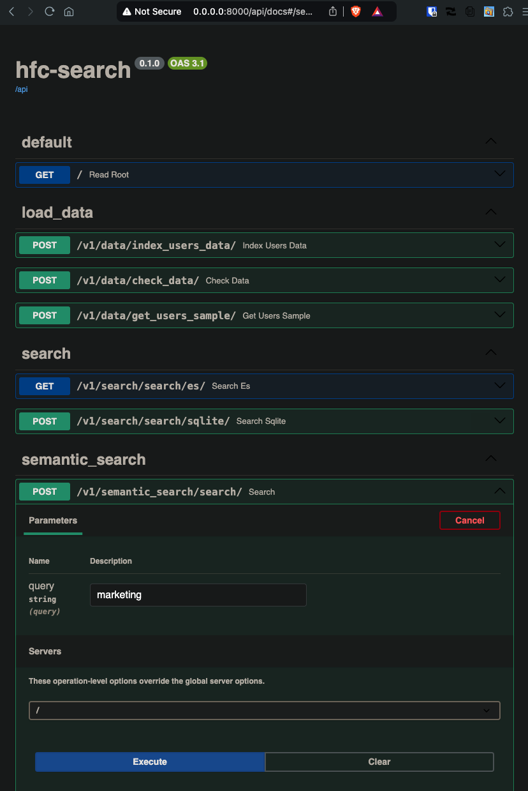

# hfc-search

## Summary

Many aspects of the coding challenge called for retrieval based on the semantic intent of the search query -- while implementing basic heuristics would have been the "quick and dirty" method of completing the task I instead attempted to implement a true semantic retrieval mechanism through a series of experiments. Recent advancements in LLMs and embedding models has lowered the bar for implementing such a system.

My first attempt was to implement vector search using elasticsearch -- unfortunately semantic search is a feature primarily supported by the managed service, so this code can be disregarded.

The code found in this repo implments an in-memory cosine similarity search using OpenAI embeddings and Sqlite.

## Dependencies

- `docker`
- `docker-compose`
- `sqlite3`
- `make`
- `OPENAI_API_KEY` environment variable

## Setup Data

- download test data into repo root

```bash
unzip DataEngCodeTest.zip
mv DataEngCodeTest site/backend/data
sqlite3 site/backend/sql_app.db "VACUUM;"
cd site/backend/
bash ../scripts/load-sql.sh
```

## Run

```bash
cd site/
docker compose up --build --remove-orphans
# OR
cd site/
make up
```

## Test

Since the embeddings are generated with each search, and stored in-memory, I have limited the user list to 50 entries. Future work includes storing the embeddings vectors in memory and using a production database like Qdrant.

`site/backend/app/routers/semantic_search.py`

```python
@router.post("/search/")
def search(query: str = "marketing", db: Session = Depends(get_db)):
    logger.info("Performing semantic search")
    users = crud.get_all_users(db)[:50]
```

Navigate to `http://localhost:8000/api/docs` and run the `/v1/semantic_search/search/` endpoint with the default query string.



Equivalent curl command:

```bash
curl -X 'POST' \
  'http://0.0.0.0:8000/v1/semantic_search/search/?query=marketing' \
  -H 'accept: application/json' \
  -d ''
```

The top five results are returned:

```js
[
  {
    "id": 42,
    "fname": "REDACTED",
    "pnoun": "[\"She/Her/Hers\"]",
    "location": "New York, NY, USA",
    "profile_bio": "I'm a fashion business management major at FIT and I'm currently interning in brand marketing at fintech.",
    "score": 0.3868412971496582
  },
  {
    "id": 17,
    "fname": "REDACTED",
    "pnoun": "[]",
    "location": "Lagos, Nigeria",
    "profile_bio": "I'm a law student with a passion for Fashion, Photography and Marketing ",
    "score": 0.4160393476486206
  },
  {
    "id": 35,
    "fname": "REDACTED",
    "pnoun": "[\"She/Her/Hers\"]",
    "location": "Atlanta, GA, USA",
    "profile_bio": "I’m a rising junior pursuing a degree in Marketing at Georgia State University. I love learning and trying to gain more knowledge about how to gain a mentor who has already achieved my goals!",
    "score": 0.41994938254356384
  },
  {
    "id": 16,
    "fname": "REDACTED",
    "pnoun": "[\"She/Her/Hers\"]",
    "location": "New York, NY, USA",
    "profile_bio": "I am a New Media and Digital Design major/con in New Media and Commerce at Fordham University. I have a passion for Digital Marketing incorporate activities as well as fashion.",
    "score": 0.42306825518608093
  },
  {
    "id": 13,
    "fname": "REDACTED",
    "pnoun": "[]",
    "location": "Aventura, FL, USA",
    "profile_bio": "Hi my name is REDACTED. I will be attending LIM college majoring in Fashion Marketing !",
    "score": 0.4235197901725769
  }
]
```

## References

- [List of academic databases and search engines - Wikipedia](https://en.wikipedia.org/wiki/List_of_academic_databases_and_search_engines)
- [Specify which fields are indexed in ElasticSearch - Stack Overflow](https://stackoverflow.com/questions/13626617/specify-which-fields-are-indexed-in-elasticsearch)
- [Run Elasticsearch locally in Docker (without security) | Elasticsearch Guide [8.14] | Elastic](https://www.elastic.co/guide/en/elasticsearch/reference/current/run-elasticsearch-locally.html)
- [Semantic search using Elasticsearch and OpenAI | OpenAI Cookbook](https://cookbook.openai.com/examples/vector_databases/elasticsearch/elasticsearch-semantic-search)
- [How to Build a Semantic Search Engine With Transformers and Faiss | by Kostas Stathoulopoulos | Towards Data Science](https://towardsdatascience.com/how-to-build-a-semantic-search-engine-with-transformers-and-faiss-dcbea307a0e8)
